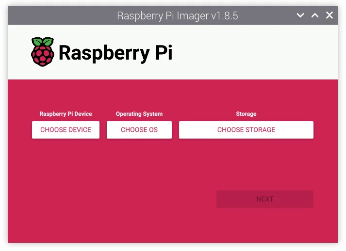

# Running Ollama models on locally on NVMe Base Rasberry Pi5

For this project, I have divided it into three sections, which may be expanded in the future. These sections are:

- **Adding a NVMe base (500GB) to Raspberry Pi 5**.
- **Running the Ollama model locally on Pi 5.**
- **Using Grafana for metric collection.**
- **Enabling event management and intelligence automation through ServiceNow.**


## Adding a NVMe base (500GB) to Raspberry Pi 5

What is NVMe Base?

NVMe Base is an add-on board for the Raspberry Pi 5 that lets you connect a fast NVMe SSD. 

What You Need

- Raspberry Pi 5
- MicroSD card (for initial setup)
- Power supply (27W)
- Active cooler (optional, but recommended for best performance)

#### Putting it Together

photo of rasberryPiandNVMeBase

#### Installing the OS

Before doing anything else, boot your Pi from the SD card and ensure the OS is up to date

- Open a terminal (Ctrl-Alt-T, or find it in the Pi OS menus) and type:
```bash
sudo apt update && sudo apt upgrade -y
```
- now type:
```bash
 lsblk
```
You should able to see your NVMe drive


### Install a New OS Using Rasberry Pi OS Desktop
You will need a microSD card with the Desktop version of the Raspberry Pi OS installed. Boot your Raspberry Pi from this card, then open 'Imager' from the Accessories menu.




Once it is complete, go to the Setting the Raspberry Pi to boot from the NVMe SSD section below

### Setting the Raspberry Pi to boot from the NVMe SSD
If you have easy access to your SD card slot you could turn off your Pi, pop out the SD card and (if everything's working as expected) it should automagically boot from your NVMe drive the next time you start it up


## Running the Ollama model locally on Pi 5

Install my-project with npm
Remote connect to rasberry pi server

```bash
  ping -4 <Rasberry Pi server name>.local
```

```bash
  ssh <userName>@<Ipaddress>
```


### Setup Ollama

```bash
  curl -fsSL https://ollama.com/install.sh | sh
```

check the status of ollama service 

```bash
  sudo systemctl status ollama
```


```bash
  ollama list
```


```bash
  ollama run tinyllama
```

